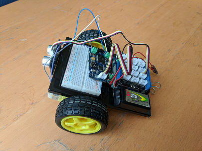
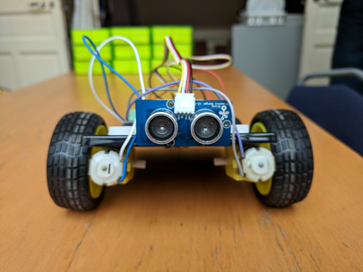

# TP de fin d'année 1ère SSI - Robot détecteur d'obstacles

L'objectif de ce TP est de mener un projet (en groupe de 4)
dans lequel vous travaillerez sur la plateforme __Arduino__. Il s'agira dans ce 
projet de concevoir un __Robot détecteur d'obstacles__.

## Matériel à disposition

* 1 carte Arduino Uno + 1 plaque d'essais
* 1 driver de moteurs Grove 
* 1 capteur à ultrason Grove
* 2 moteurs et 2 roues
* 1 pile de 9V + 1 clip pour pile + 1 interrupteur switch
* 1 pince double clip

## Cahier des charges

* La conception de votre système doit être réalisé sous forme d'une __machine à
états finis__ cadencé à 10 Hz.
* Le robot doit rouler à peu près droit et s'arrêter __progressivement__ à la
détection d'un obstacle. La distance minimale par rapport à l'obstacle doit être de
__5 cm__.

## Par où commencer

### Partie montage

Montez le robot en vous inspirant des photos ci-dessous.

&nbsp;&nbsp;&nbsp;&nbsp;&nbsp;&nbsp;

### Partie analyser/expérimenter

Testez d'abord le programme dans la branche __ultrason_grove__ 
(Utilisation du capteur à ultrason) puis le programme dans la branche 
__moteurs_grove__ (Utilisation du driver de moteurs). Puis une fois
compris, basculer dans la branche __tp_robot__ dans
lequel vous travaillerez.

Vous devez établir un diagramme d'états/transitions sur papier. Une fois
validé par votre professeur celui-ci sera traduit sous forme de 
programme dans le fichier __main.ino__.
